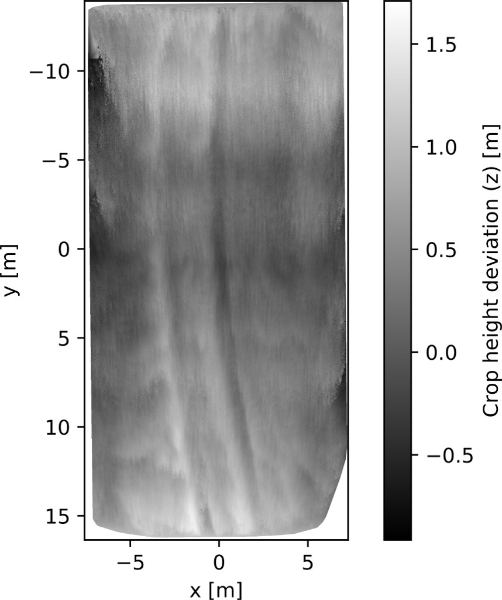
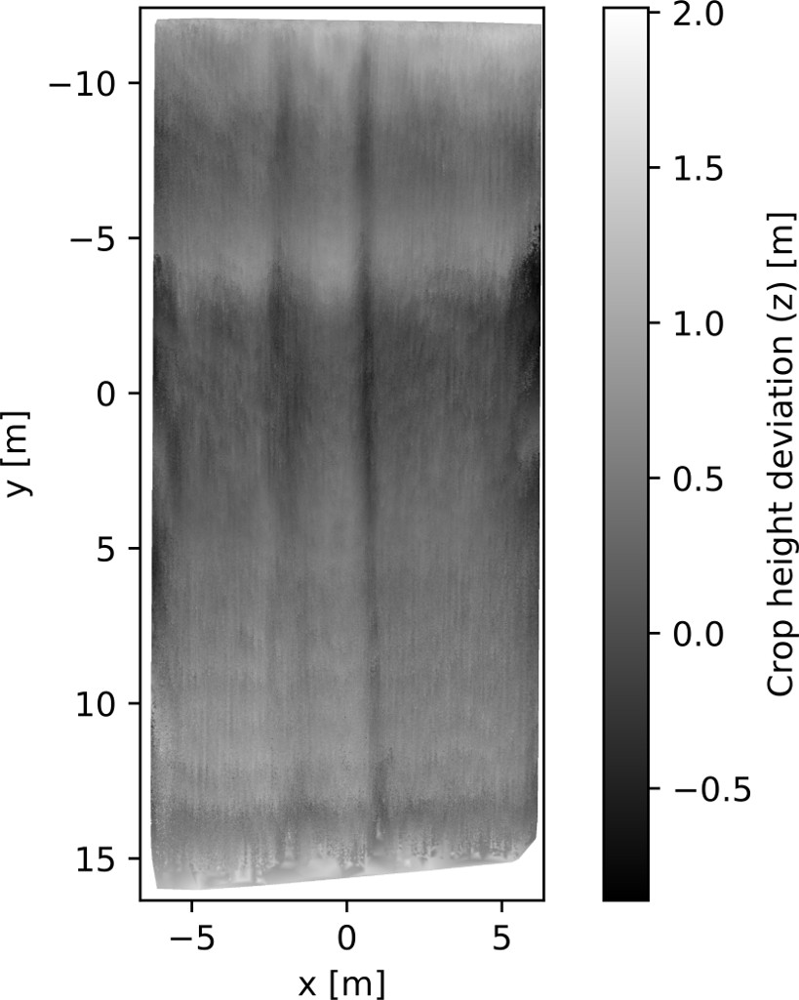
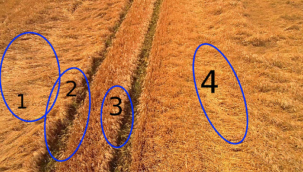
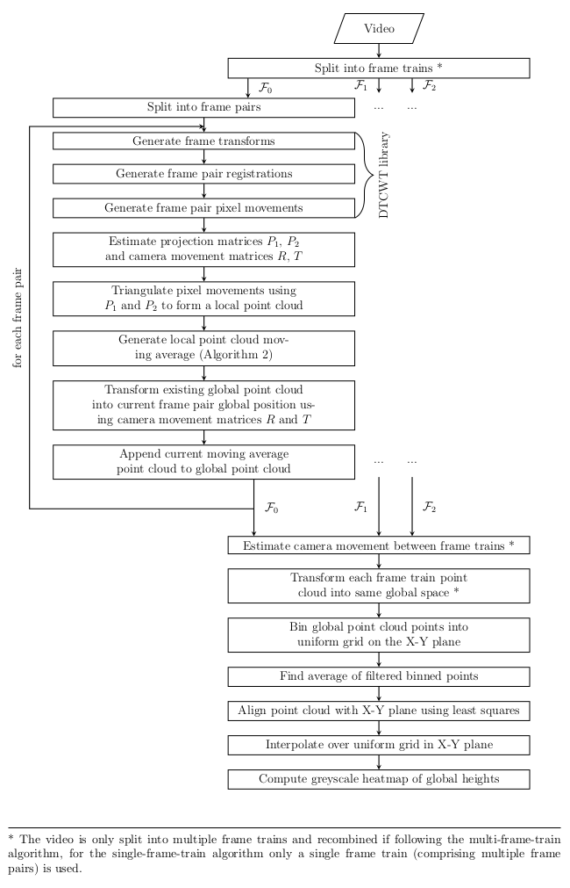

# Field Photogrammetric Reconstruction

## Summary

This python project provides a method of photogrammetrically reconstructing the topography of a crop field (or other planar surface) from single-camera aerial video footage. Pixel correspondence information is determined from frame-pairs through use of the Dual-Tree Complex Wavelet Transform (DTCWT). A typical use of this project is for the close monitoring of crop growth using footage obtained from a relatively cheap (relative to manual inspection) off-the-shelf drone.

## Installation

The following python packages are required:

- numpy
- OpenCV
- [dtcwt](https://pypi.python.org/pypi/dtcwt/) (`pip install dtcwt`)
- matplotlib
- scipy

This git repository should be cloned with the command 

```
$ git clone --recurse-submodules https://github.com/mattjudge/field-photogrammetric-reconstruction.git
```

or

```
$ git clone https://github.com/mattjudge/field-photogrammetric-reconstruction.git
$ cd field-photogrammetric-reconstruction
$ git submodule init
$ git submodule update
```

## Usage

Documentation is available [here](./docs/code_docs.md) (rendered from the python docstrings throughout the code). Example usage can be seen in [`example_usage.py`](./example_usage.py):

```python
import numpy as np
from field_reconstruction import video, reconstruction

vid = video.Video(r"video2.mp4")
clip = video.Clip(vid, startframe=0, stopframe=298)

print("Loaded video {fname}, shape: {shape}, fps: {fps}, start: {start}, stop: {stop}".format(
    fname=clip.video.path, shape=clip.video.shape, fps=clip.video.fps,
    start=clip.start_frame, stop=clip.stop_frame))

# estimated from tractor treads in video
camera_proj_mat = np.array(
    [[1883, 0, 910],
     [0, 1883, 490],
     [0, 0, 1]]
)

reconstruction.render_reconstruct_world(
    clip, camera_proj_mat, frame_step=3, path='./output/', include_intermediates=False, multiproc=False,
    render_mode='standard', render_scale=3.3, render_gsigma=1
)
```

Example renders (from the sample videos available [here](../../releases/tag/v0.1)) are displayed below:

| Example render from `video1.mp4`       | Example render from `video2.mp4`       |
| -------------------------------------- | -------------------------------------- |
|  |  |

The above renders display notable points of interest (examples annotated below from video 1) including crop lodging (1 & 4) and stark height differences next to the tractor treads (2 & 3), correctly showing high crop ridges next to the treads.



## Methodology

The flowchart below summarises the approach taken by this project in order to reconstruct a field's topography:



## Limitations

This project should be considered development code, not production ready.

The master branch suffers from performance issues (both speed and memory usage), which have been considerably mitigated in the [`no_pix_interp`](../../tree/no_pix_interp) branch. This improvement centres around the triangulation of a single pixel correspondence from each 16x16 block processed by the DTCWT algorithms rather than triangulating interpolated correspondences for every pixel (the master branch's current behaviour). Unfortunately there are still some artefact issues to be worked on before this improvement can be merged. However, if performance is an issue, it is strongly recommended to try the `no_pix_interp` branch.

## License

(c) 2017 Matt Judge. The code is made available under the MIT License - see the [LICENSE](./LICENSE) file.

----

References: The code in this repository was initially developed as part of the author's Master's Project. This readme file contains excerpts taken from the project's final report.

Acknowledgements: I would like to extend my thanks to my academic supervisor Prof Nick Kingsbury for his advice and sharing of considerable knowledge throughout my Master's project, and to PA Consulting for their sponsorship and supply of drone footage.